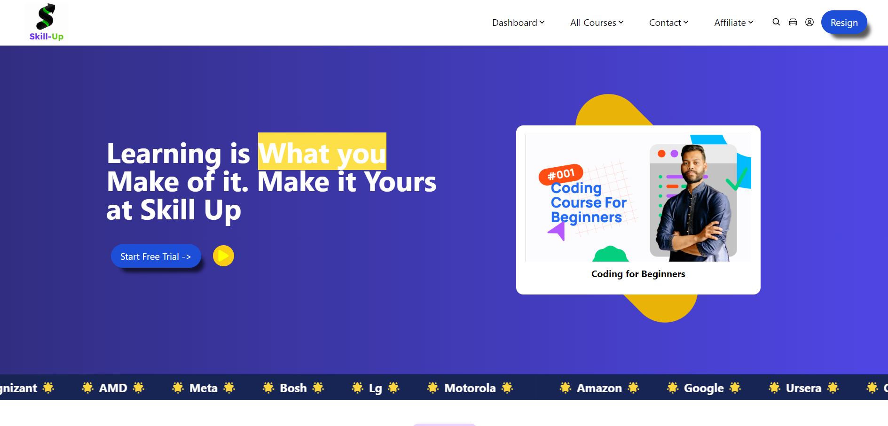

# 🎓 Skill-up

Welcome to **Skill-up**, an EdTech platform providing a variety of courses for students. This project is a landing page designed to showcase the features and benefits of Skill-up.

## 🌐 Live Demo

Check out the live demo of the project [here](https://skillupio.netlify.app/).

## 📝 Project Description

Skill-up is an educational technology platform aimed at enhancing learning experiences for students. The landing page provides an overview of the platform, highlighting key features and available courses. Built with modern web technologies, it offers a responsive and user-friendly interface.

## 📸 Screenshot

[](https://skillupio.netlify.app/)

## 🚀 Installation Instructions

To set up the project locally, follow these steps:

1. Clone the repository:
    ```sh
    git clone https://github.com/your-username/skill-up.git
    ```
2. Navigate to the project directory:
    ```sh
    cd skill-up
    ```
3. Install the dependencies:
    ```sh
    npm install
    ```
4. Start the development server:
    ```sh
    npm start
    ```

## 💡 Usage Instructions

Once the development server is running, you can access the project in your web browser at `http://localhost:3000`. The landing page will showcase various courses and features offered by Skill-up.

## ⚙️ Technologies Used

- **React**: A JavaScript library for building user interfaces.
- **Tailwind CSS**: A utility-first CSS framework for rapid UI development.
- **React Router**: A standard library for routing in React applications.

## 🤝 Contributing Guidelines

We welcome contributions to enhance the project. To contribute:

1. Fork the repository.
2. Create a new branch for your feature or bug fix:
    ```sh
    git checkout -b feature/your-feature-name
    ```
3. Commit your changes:
    ```sh
    git commit -m "Add feature: your feature name"
    ```
4. Push to the branch:
    ```sh
    git push origin feature/your-feature-name
    ```
5. Create a Pull Request detailing your changes.

## 📜 License

This project is licensed under the MIT License. See the [LICENSE](LICENSE) file for details.

---

Thank you for contributing to Skill-up! If you have any questions or feedback, feel free to reach out. 😊

Made with 💖 Sanjeev
